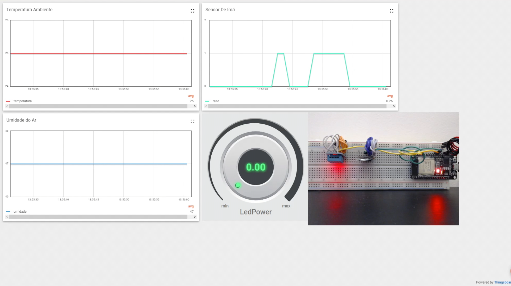

# Trabalho Final

## Integrantes

| Nome | Matrícula |
|-|-|
| Liverson Paulo Furtado Severo | 18/0022237 |
| Alvaro Henrique de Sousa Gouvea  | 18/0012002 |

## Especificações

O código foi desenvolvido para rodar na ESP32

V5.0

Utilizamos a Espressif.

## Configuração

Para configurar, na pasta root do projeto digite:

  idf.py menuconfig

Configure o wifi como desejar.

## Rodar

Para rodar basicamente é necessário clicar na barra debaixo do VSCode para compilar o código e mostrar o monitor.

No caso do Álvaro ele precisou utilizar o script do seguinte repositório para fazer rodar

  https://gist.github.com/abobija/2f11d1b2c7cb079bec4df6e2348d969f

Isso se deu porque ele utiliza o WSL.

Para execução sem utilização de extensões do VSCode é necessário possuir a instalação local da espressif e executar os seguintes comandos:
* idf.py build (para construir o código)
* idf.py flash -p <PORT> (para subir o código para a sua placa)

## Thingsboard e sensores
O Projeto foi executado utilizando a Dashboard localizada no link: http://164.41.98.25:443/dashboards/0beea240-aae3-11ed-8436-09bf763c9306
Os sensores utilizados foram:
* DHT11 - Para temperatura e umidade do ar
* Mini Reed - Para reconhecer presença de imã

Além do Led presente na placa por meio de controle PWM via dimmer.

### Vídeo
O vídeo de apresentação dos sensores na ThingsBoard está dispónível aqui:
[Video de Explicação](https://youtu.be/63ZMA1ipVv8)

### Imagens
